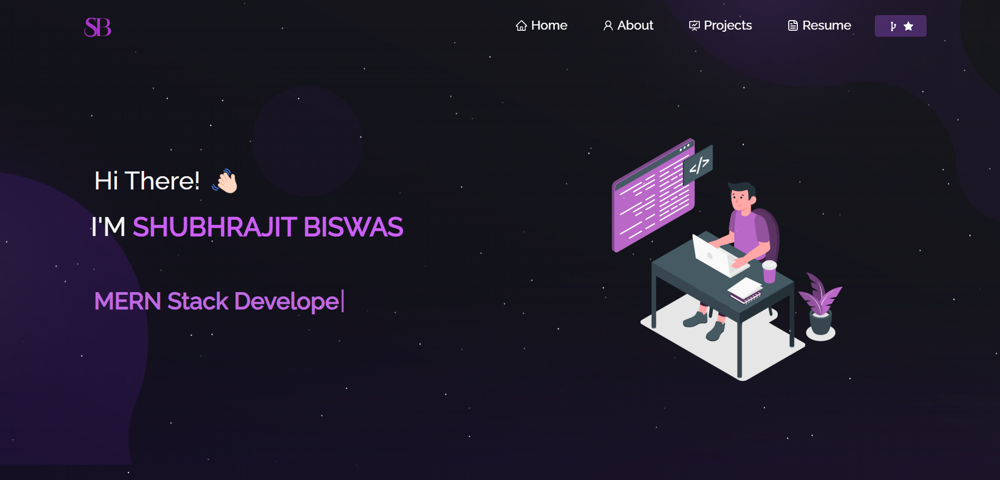

<h2 align="center">
  Portfolio Website 
  <a href="https://portfolio-shubhrajit-biswas-projects.vercel.app/" target="_blank">Shubhrajit Biswas</a>
</h2>

  

 

<h3 align="center">
  🔹 <a href="https://github.com/ShubhrajitBiswas/portfolio/issues">Report Bug</a> &nbsp; &nbsp; 🔹 <a href="https://github.com/ShubhrajitBiswas/portfolio/issues">Request Feature</a>
</h3>

## 🚀 About the Project

This is my personal portfolio website, built to showcase my GitHub projects, resume, and technical skills. You can explore the live website here: <a href="https://portfolio-shubhrajit-biswas-projects.vercel.app/" target="_blank">Shubhrajit Biswas</a>.

The website has a multi-page layout, is fully responsive, and features easy-to-customize styling.

## 🛠️ Built With
The project was built using the following technologies:

React.js for the frontend
Node.js and Express.js for backend setup
CSS3 for styling
React-Bootstrap for UI components
Vercel for deployment
GitHub for version control
VS Code for development
## 🌟 Features
📖 Multi-Page Layout: Organized and easy navigation
🎨 Styled Design: Clean and customizable UI
📱 Fully Responsive: Compatible with all screen sizes
## ⚙️ Getting Started
To run this project locally, follow these steps:

## Prerequisites
Ensure that you have the following installed on your machine:

Node.js
Git
Installation and Setup
Clone the repository:

bash
git clone https://github.com/ShubhrajitBiswas/portfolio.git
Navigate to the project directory:

bash
cd portfolio
Install dependencies:

bash
npm install
Run the development server:

bash
npm start
The app will run in development mode. Open http://localhost:3000 in your browser to view it.

## 📖 Usage Instructions
To customize the portfolio:

Open the project folder.
Navigate to the /src/components/ directory.
Modify the components to update your information, such as your name, projects, and skills.
##  ❤️ Show Your Support
Give this repository a ⭐ if you found it helpful or inspiring!

🤝 Contributions
Contributions, issues, and feature requests are welcome! Feel free to check the issues page.
